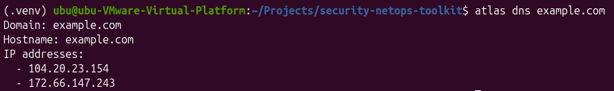
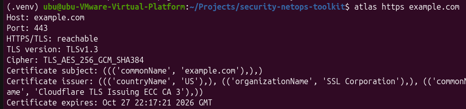
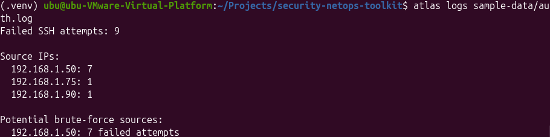
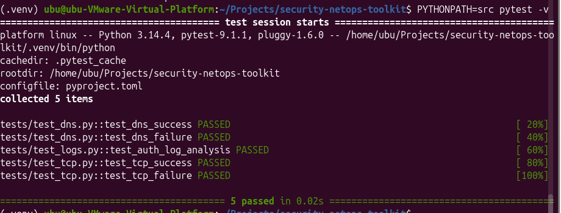
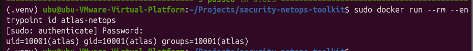
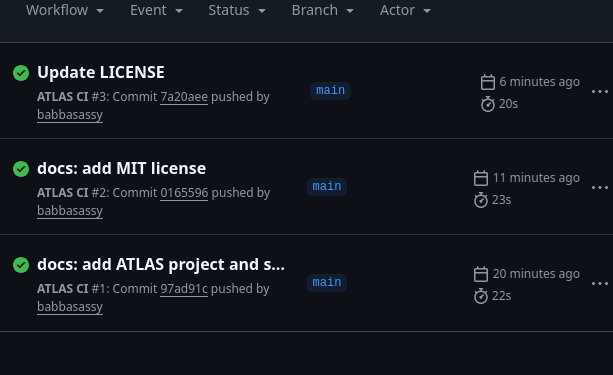

# ATLAS Security NetOps Toolkit


ATLAS is a containerized Python command-line toolkit for network diagnostics and basic security log analysis.

The project was built as a practical cybersecurity and IT portfolio project to demonstrate hands-on knowledge of Linux, networking, Python, security automation, testing, Docker, Git and CI/CD.

---

## Features

ATLAS currently provides:

- DNS resolution
- TCP connectivity testing
- HTTPS/TLS inspection
- TLS version and cipher inspection
- Certificate information
- SSH authentication log analysis
- Basic detection of potential brute-force activity
- Human-readable terminal output
- JSON output
- Automated unit tests
- Docker containerization
- Non-root container execution
- GitHub Actions CI

---

## Architecture

ATLAS uses a modular architecture where the command-line interface sends each task to a dedicated Python module.

```text
User
  |
  v
ATLAS CLI
  |
  +----------------+----------------+----------------+
  |                |                |                |
  v                v                v                v
DNS Module     TCP Module      HTTPS/TLS       Log Analyzer
  |                |             Module             |
  v                v                |               v
Resolver        TCP Socket           v        Authentication Logs
                              TLS Handshake          |
                                                   v
                                         Failed Login Detection
                                                   |
                                                   v
                                        Suspicious Source Report
```

More technical information is available in:

```text
docs/architecture.md
```

---

## Screenshots

### DNS Resolution

ATLAS resolves a domain name and returns the associated IP addresses.



### HTTPS/TLS Inspection

ATLAS establishes a TLS connection and retrieves information such as the negotiated TLS version, cipher suite and certificate details.



### SSH Brute-Force Detection

ATLAS analyzes authentication logs, counts failed SSH login attempts and highlights IP addresses that exceed the configured threshold.



### Automated Tests

The project contains automated tests for DNS, TCP and authentication log analysis functionality.



### Docker Non-Root Execution

The ATLAS Docker container runs as a dedicated non-root user with UID `10001`.



### GitHub Actions CI

GitHub Actions automatically tests the Python application and builds the Docker image when changes are pushed to the repository.



---

## Project Structure

```text
atlas-security-netops-toolkit/
├── .github/
│   └── workflows/
│       └── ci.yml
│
├── docs/
│   ├── architecture.md
│   └── screenshots/
│       ├── atlas-dns.png
│       ├── atlas-log-detection.png
│       ├── atlas-tls.png
│       ├── docker-non-root.png
│       ├── github-actions-ci.png
│       └── pytest-passed.png
│
├── sample-data/
│   └── auth.log
│
├── src/
│   └── netdiag/
│       ├── __init__.py
│       ├── dns.py
│       ├── https.py
│       ├── logs.py
│       ├── main.py
│       └── tcp.py
│
├── tests/
│   ├── test_dns.py
│   ├── test_logs.py
│   └── test_tcp.py
│
├── .dockerignore
├── .gitignore
├── Dockerfile
├── LICENSE
├── pyproject.toml
├── README.md
├── requirements.txt
└── SECURITY.md
```

---

## Installation

### 1. Clone the repository

```bash
git clone https://github.com/babbasassy/atlas-security-netops-toolkit.git
```

```bash
cd atlas-security-netops-toolkit
```

### 2. Create a Python virtual environment

```bash
python3 -m venv .venv
```

### 3. Activate the environment

```bash
source .venv/bin/activate
```

### 4. Install ATLAS

```bash
python -m pip install -e .
```

### 5. Verify the installation

```bash
atlas --help
```

---

## Usage

### DNS Resolution

```bash
atlas dns example.com
```

Example output:

```text
Domain: example.com
Hostname: example.com
IP addresses:
  - 104.20.23.154
  - 172.66.147.243
```

---

### TCP Connectivity

Test whether a TCP connection can be established to a specific host and port.

```bash
atlas tcp example.com 443
```

Example:

```text
Host: example.com
Port: 443
Status: reachable
```

---

### HTTPS/TLS Inspection

Inspect the TLS connection used by a HTTPS service.

```bash
atlas https example.com
```

Example information includes:

```text
TLS version
Cipher suite
Certificate subject
Certificate issuer
Certificate expiration
```

---

### Authentication Log Analysis

Analyze the included synthetic SSH authentication log:

```bash
atlas logs sample-data/auth.log
```

Example output:

```text
Failed SSH attempts: 9

Source IPs:
  192.168.1.50: 7
  192.168.1.75: 1
  192.168.1.90: 1

Potential brute-force sources:
  192.168.1.50: 7 failed attempts
```

The included authentication data is synthetic and contains no real user activity.

---

## JSON Output

ATLAS also supports structured JSON output.

Example:

```bash
atlas --json dns example.com
```

Example result:

```json
{
  "success": true,
  "hostname": "example.com",
  "addresses": [
    "172.66.147.243",
    "104.20.23.154"
  ]
}
```

This makes ATLAS easier to integrate with scripts and other automation workflows.

---

## Docker

ATLAS can run entirely inside a Docker container.

### Build the image

```bash
sudo docker build -t atlas-netops .
```

### DNS lookup

```bash
sudo docker run --rm atlas-netops dns example.com
```

### TCP connectivity

```bash
sudo docker run --rm atlas-netops tcp example.com 443
```

### TLS inspection

```bash
sudo docker run --rm atlas-netops https example.com
```

### Log analysis

```bash
sudo docker run --rm atlas-netops logs sample-data/auth.log
```

---

## Container Security

The Docker image runs ATLAS using a dedicated non-root user:

```text
uid=10001(atlas)
gid=10001(atlas)
```

Additional runtime restrictions can be applied:

```bash
sudo docker run --rm \
  --read-only \
  --cap-drop=ALL \
  --security-opt=no-new-privileges \
  atlas-netops dns example.com
```

These options demonstrate the principle of least privilege and reduce unnecessary container permissions.

---

## Automated Testing

ATLAS uses `pytest` for automated testing.

Run the complete test suite:

```bash
PYTHONPATH=src pytest -v
```

The current automated tests cover:

- successful DNS resolution
- DNS failure handling
- successful TCP connection handling
- TCP failure handling
- SSH authentication log analysis

Current result:

```text
5 passed
```

External network operations are mocked where appropriate so unit tests do not depend on public internet availability.

---

## CI/CD

The repository uses GitHub Actions for continuous integration.

The workflow runs automatically on pushes and pull requests targeting the `main` branch.

```text
Push / Pull Request
        |
        +--> Checkout Repository
        |
        +--> Python Tests
        |
        +--> Docker Build
        |
        +--> Verify Non-Root Container User
        |
        +--> Container Smoke Test
        |
        v
     PASS / FAIL
```

The workflow helps detect regressions before changes are merged.

---

## Security Design

ATLAS demonstrates several security engineering principles:

- least privilege
- non-root container execution
- controlled exception handling
- isolated Python environments
- automated testing
- read-only container support
- removal of unnecessary Linux capabilities
- `no-new-privileges` support
- `.env` files excluded from Git
- synthetic test data
- read-only GitHub Actions repository permissions
- reproducible container builds

---

## Technologies

This project uses:

- Python 3
- Linux
- TCP/IP
- DNS
- TLS
- Git
- GitHub
- pytest
- Docker
- GitHub Actions

---

## What I Learned

Building ATLAS allowed me to combine several areas of IT and cybersecurity into one practical project.

I gained hands-on experience with:

- Linux command-line workflows
- Git and version control
- Python application development
- Python modules and packages
- command-line interfaces
- DNS resolution
- TCP socket connections
- TLS handshakes
- certificate inspection
- authentication log analysis
- regular expressions
- basic detection logic
- JSON output
- exception handling
- unit testing
- mocking external services
- Docker containerization
- container hardening
- least privilege
- GitHub Actions
- automated CI pipelines

Instead of treating these technologies as separate topics, ATLAS combines them into one reproducible security and network operations workflow.

---

## Limitations

ATLAS is an educational and portfolio project.

It is not intended to replace enterprise solutions such as:

- SIEM platforms
- vulnerability management systems
- network monitoring platforms
- IDS/IPS products
- enterprise incident detection systems

The current brute-force detection logic is intentionally simple and uses a failed-login threshold.

Network functionality should only be used against systems and networks that the user owns or has explicit authorization to test.

---

## Future Improvements

Planned or possible future improvements include:

- configurable brute-force thresholds
- IPv6 support
- structured application logging
- improved TLS certificate validation
- additional authentication log formats
- SIEM export
- Sigma rule integration
- additional automated tests
- richer JSON reporting
- configurable timeouts
- local `atlas.lab` environment
- additional network diagnostics

---

## Responsible Use

ATLAS is intended for authorized learning, troubleshooting and security testing.

Do not use the network functionality against systems or networks without permission.

See:

```text
SECURITY.md
```

for additional security and responsible-use information.

---

## License

This project is released under the MIT License.

See:

```text
LICENSE
```

for details.
